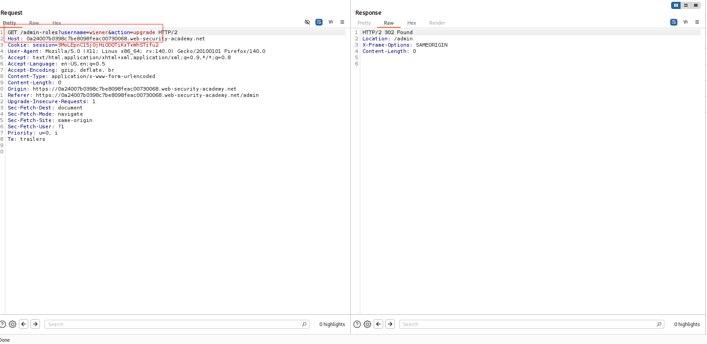

---

# Описание
Уязвимость контроля доступа, при которой приложение проверяет права администратора только для определённого HTTP-метода (например, POST), но не применяет эти проверки к другим методам (GET). Атакующий, аутентифицированный как обычный пользователь, изменяет метод запроса с POST на GET и выполняет привилегированное действие (повышение роли до администратора), обходя проверку авторизации.
## Обнаружение/Идентификация
В ходе проведения работ был перехвачен легитимный запрос администратора. Использования данного запроса с пользовательскими cookies, не дало результата. Смена метода запроса на GET позволило проэксплуатировать уязвимость

Рисунок 1 - Повышение привилегий wiener
## Риски
- **Полный захват административной панели** без учётных данных.
- **Компрометация пользователей**: удаление, блокировка, изменение ролей.
- **Утечка конфиденциальных данных**: доступ к персональным данным, финансовой информации.
- **Нарушение целостности**: изменение конфигураций, внедрение бэкдоров.

## Рекомендации
- **Внедрить обязательную аутентификацию** для всех административных эндпоинтов.
- **Проверять авторизацию на сервере** при каждом запросе, не полагаясь на скрытие URL.
- **Использовать централизованную систему контроля доступа** (RBAC, ABAC).
- **Убрать чувствительные пути из `robots.txt`** и других публичных файлов.
- **Включить многофакторную аутентификацию** для административных аккаунтов.
- **Вести мониторинг** доступа к административным разделам и аномальных запросов.
- **Провести аудит** всех административных функций на предмет отсутствия проверок прав.

