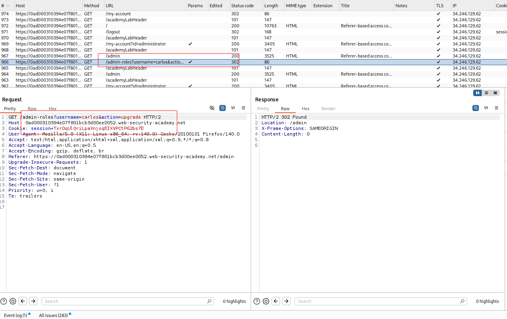
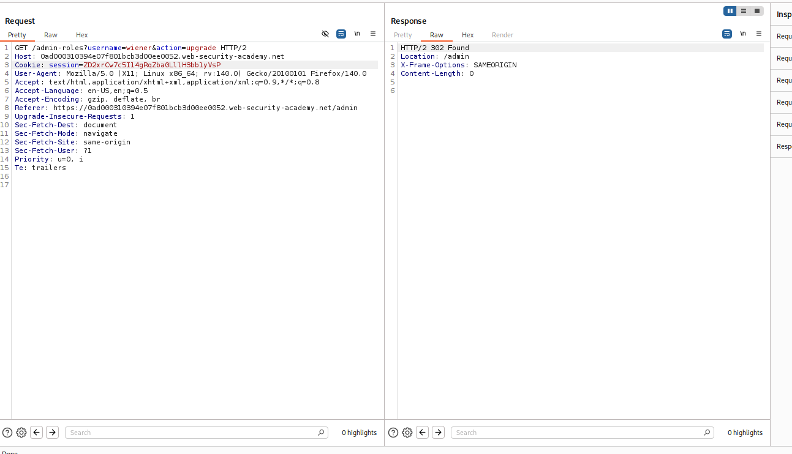

---

# Описание
Уязвимость контроля доступа, при которой приложение принимает решение об авторизации на основе значения HTTP-заголовка `Referer`. Сервер проверяет, что запрос к административной функции поступил со страницы административной панели, но не проверяет реальную роль пользователя в сессии. Поскольку заголовок `Referer` полностью контролируется клиентом, атакующий подделывает его и выполняет привилегированные действия от имени обычного пользователя.
## Обнаружение/Идентификация
Авторизуемся от имени администратора, и используем функцию апгрейда carlos

Рисунок 1 - Запрос на повышение привилегий 
Выходим из аккаунта администратора, повторяем запрос с cookies wiener

Рисунок 2 - Повышение привилегий за wiener
## Риски
- **Полный захват административной панели** без учётных данных.
- **Компрометация пользователей**: удаление, блокировка, изменение ролей.
- **Утечка конфиденциальных данных**: доступ к персональным данным, финансовой информации.
- **Нарушение целостности**: изменение конфигураций, внедрение бэкдоров.

## Рекомендации
- **Внедрить обязательную аутентификацию** для всех административных эндпоинтов.
- **Проверять авторизацию на сервере** при каждом запросе, не полагаясь на скрытие URL.
- **Использовать централизованную систему контроля доступа** (RBAC, ABAC).
- **Убрать чувствительные пути из `robots.txt`** и других публичных файлов.
- **Включить многофакторную аутентификацию** для административных аккаунтов.
- **Вести мониторинг** доступа к административным разделам и аномальных запросов.
- **Провести аудит** всех административных функций на предмет отсутствия проверок прав.

