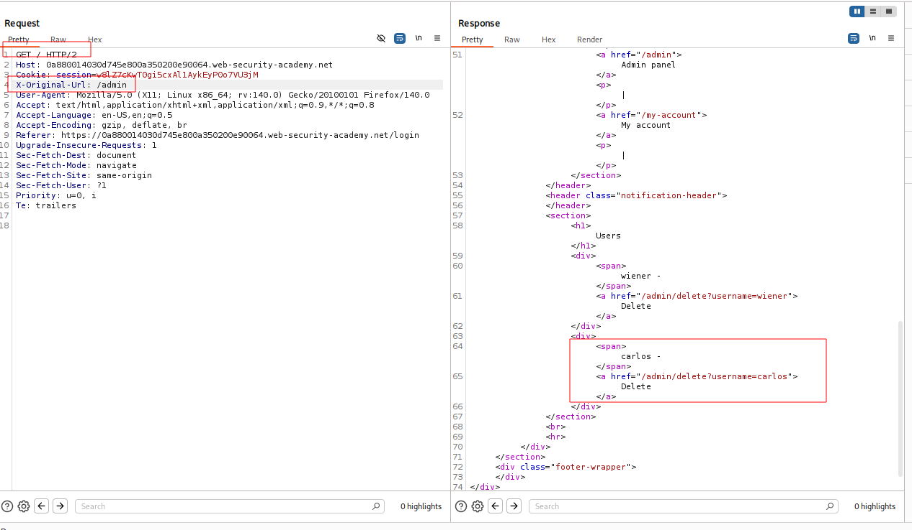
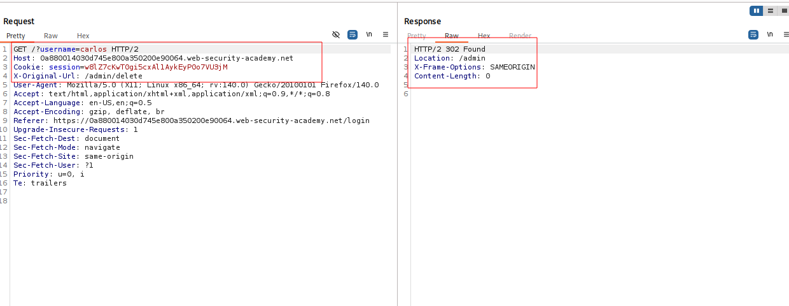

---

# Описание
Уязвимость контроля доступа, при которой приложение (или обратный прокси) принимает решение об авторизации на основе URL-пути запроса, но при этом доверяет клиентским заголовкам `X-Original-URL` / `X-Rewrite-URL`. Атакующий отправляет запрос к разрешённому пути, указывая в заголовке административный URL, и обходит ограничения, получая доступ к функциям панели администратора.
## Обнаружение/Идентификация
В результате использования заголовка x-original-url был удален пользователь carlos

Рисунок 1 - Получение пути

Рисунок 2 - Успешное удаление пользователя

## Риски
- **Полный захват административной панели** без учётных данных.
- **Компрометация пользователей**: удаление, блокировка, изменение ролей.
- **Утечка конфиденциальных данных**: доступ к персональным данным, финансовой информации.
- **Нарушение целостности**: изменение конфигураций, внедрение бэкдоров.

## Рекомендации
- **Внедрить обязательную аутентификацию** для всех административных эндпоинтов.
- **Проверять авторизацию на сервере** при каждом запросе, не полагаясь на скрытие URL.
- **Использовать централизованную систему контроля доступа** (RBAC, ABAC).
- **Убрать чувствительные пути из `robots.txt`** и других публичных файлов.
- **Включить многофакторную аутентификацию** для административных аккаунтов.
- **Вести мониторинг** доступа к административным разделам и аномальных запросов.
- **Провести аудит** всех административных функций на предмет отсутствия проверок прав.

