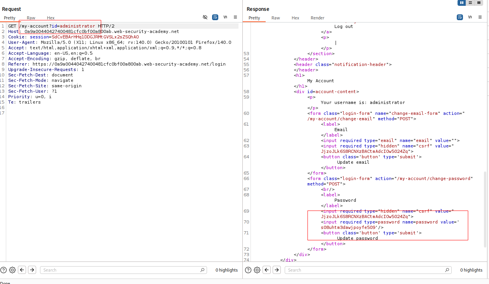

---

# Описание
Уязвимость контроля доступа, при которой приложение использует клиентский параметр `id` для выбора учётной записи пользователя без проверки прав на стороне сервера. При подстановке идентификатора другого пользователя (например, `administrator`) сервер возвращает страницу его профиля, в которой пароль отображается в предзаполненном поле формы смены пароля. Атакующий извлекает пароль администратора и получает полный контроль над приложением.
## Обнаружение/Идентификация
В ходе анализа HTTP-ответов сервера, был обнаружен пароль пользователя администратор

Рисунок 1 - Раскрытие пароля администратора
## Риски
- **Полный захват административной панели** без учётных данных.
- **Компрометация пользователей**: удаление, блокировка, изменение ролей.
- **Утечка конфиденциальных данных**: доступ к персональным данным, финансовой информации.
- **Нарушение целостности**: изменение конфигураций, внедрение бэкдоров.

## Рекомендации
- **Внедрить обязательную аутентификацию** для всех административных эндпоинтов.
- **Проверять авторизацию на сервере** при каждом запросе, не полагаясь на скрытие URL.
- **Использовать централизованную систему контроля доступа** (RBAC, ABAC).
- **Убрать чувствительные пути из `robots.txt`** и других публичных файлов.
- **Включить многофакторную аутентификацию** для административных аккаунтов.
- **Вести мониторинг** доступа к административным разделам и аномальных запросов.
- **Провести аудит** всех административных функций на предмет отсутствия проверок прав.

