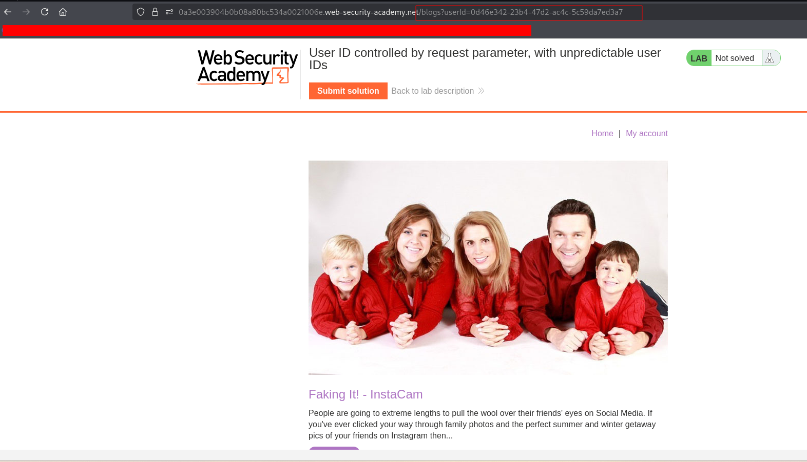
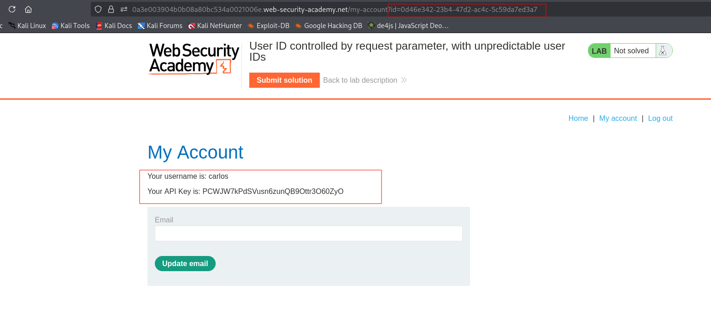

---

# Описание
Уязвимость контроля доступа, при которой приложение использует клиентский параметр `id` для выбора учётной записи пользователя. Идентификаторы пользователей являются непредсказуемыми (GUID/UUID), однако они раскрываются в публично доступном контенте (например, в ссылках на авторов блога). Атакующий собирает GUID другого пользователя из открытых источников и подставляет его в запрос, получая доступ к чужому профилю и конфиденциальным данным (API-ключу).
## Обнаружение/Идентификация
В результате изучения постов приложения, был найден пост пользователя  carlos, который раскрывает его GUID.

Рисунок 1- Получение GUID

Рисунок 2 - Раскрытие api ключа
## Риски
- **Полный захват административной панели** без учётных данных.
- **Компрометация пользователей**: удаление, блокировка, изменение ролей.
- **Утечка конфиденциальных данных**: доступ к персональным данным, финансовой информации.
- **Нарушение целостности**: изменение конфигураций, внедрение бэкдоров.

## Рекомендации
- **Внедрить обязательную аутентификацию** для всех административных эндпоинтов.
- **Проверять авторизацию на сервере** при каждом запросе, не полагаясь на скрытие URL.
- **Использовать централизованную систему контроля доступа** (RBAC, ABAC).
- **Убрать чувствительные пути из `robots.txt`** и других публичных файлов.
- **Включить многофакторную аутентификацию** для административных аккаунтов.
- **Вести мониторинг** доступа к административным разделам и аномальных запросов.
- **Провести аудит** всех административных функций на предмет отсутствия проверок прав.

