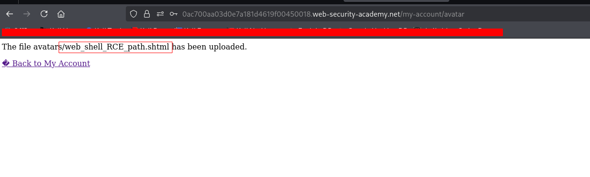

---

# Описание
Уязвимость неограниченной загрузки файлов, при которой серверная часть использует чёрный список опасных расширений (`.php`, `.phtml` и т.п.), но не запрещает загрузку служебных файлов `.htaccess`. Атакующий загружает `.htaccess`, который настраивает Apache обрабатывать произвольное расширение (например, `.l33t`) как PHP-код, после чего загружает веб-оболочку с этим расширением и выполняет произвольный код на сервере.
## Обнаружение/Идентификация

Рисунок 1 - Загрузка payload

### Риски

- **Полный захват веб-сервера** и выполнение кода от имени пользователя веб-сервера.
- **Утечка конфиденциальных данных**: конфигурации, базы данных, ключи, исходный код.
- **Горизонтальное перемещение**: использование сервера как плацдарма для атак на внутреннюю сеть.
- **Установка постоянного бэкдора**: reverse shell, cron-задачи, вредоносные модули.
- **Нарушение compliance**: утечка персональных данных (GDPR, 152-ФЗ, PCI DSS).

### Рекомендации

- **Белый список расширений** — разрешать только безопасные типы (`.jpg`, `.png`, `.pdf`).
- **Проверка MIME-типа** и сигнатур файлов (magic bytes).
- **Хранение загруженных файлов вне webroot** или с отключённым выполнением скриптов.
- **Переименование файлов** (случайные имена, без оригинального расширения).
- **Ограничение размера** и количества загружаемых файлов.
- **Сканирование антивирусом** и проверка на веб-оболочки.
- **WAF** для блокировки попыток загрузки исполняемых файлов.
- **Провести аудит** всех точек загрузки файлов и настроек веб-сервера.

