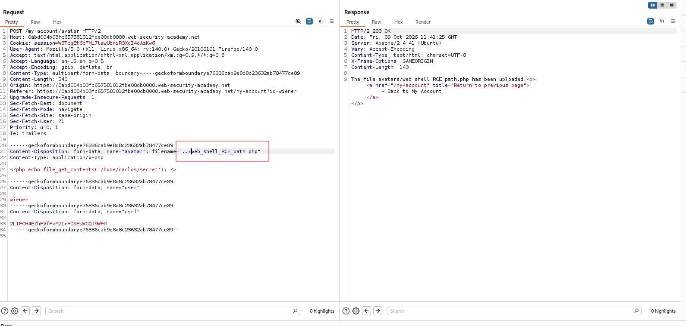
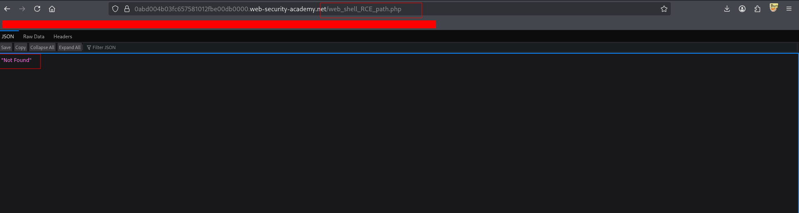
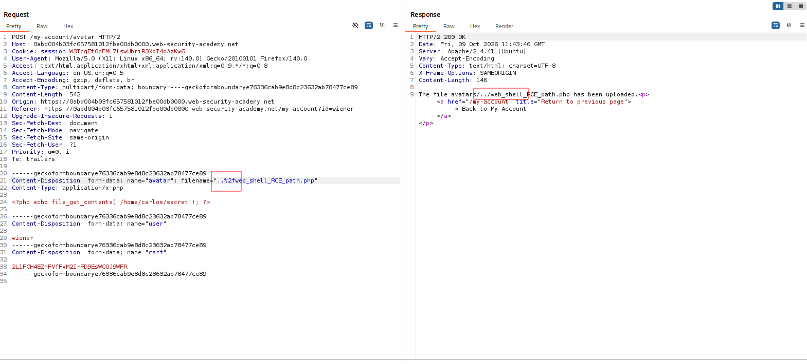
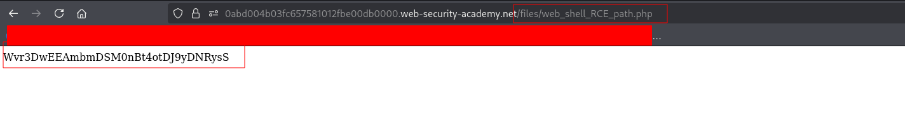

---

# Описание
Уязвимость неограниченной загрузки файлов в сочетании с обходом каталога. Приложение сохраняет загруженный файл, используя предоставленное клиентом имя без санитизации. Атакующий применяет последовательности `../` в поле `filename`, чтобы выйти из директории `/files/avatars/` и разместить PHP-веб-оболочку в каталоге `/files/`, где выполнение скриптов разрешено. Это приводит к удалённому выполнению кода.
## Обнаружение/Идентификация

Рисунок 1 - HTTP-запрос с path travel

Рисунок 2 - 404 ошибка

Рисунок 3 - HTTP-запрос с обуфисцированием

Рисунок 4 -  Результат вывода
### Риски

- **Полный захват веб-сервера** и выполнение кода от имени пользователя веб-сервера.
- **Утечка конфиденциальных данных**: конфигурации, базы данных, ключи, исходный код.
- **Горизонтальное перемещение**: использование сервера как плацдарма для атак на внутреннюю сеть.
- **Установка постоянного бэкдора**: reverse shell, cron-задачи, вредоносные модули.
- **Нарушение compliance**: утечка персональных данных (GDPR, 152-ФЗ, PCI DSS).

### Рекомендации

- **Белый список расширений** — разрешать только безопасные типы (`.jpg`, `.png`, `.pdf`).
- **Проверка MIME-типа** и сигнатур файлов (magic bytes).
- **Хранение загруженных файлов вне webroot** или с отключённым выполнением скриптов.
- **Переименование файлов** (случайные имена, без оригинального расширения).
- **Ограничение размера** и количества загружаемых файлов.
- **Сканирование антивирусом** и проверка на веб-оболочки.
- **WAF** для блокировки попыток загрузки исполняемых файлов.
- **Провести аудит** всех точек загрузки файлов и настроек веб-сервера.

