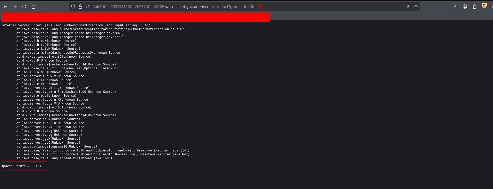

---

# Описание
Уязвимость раскрытия информации, при которой приложение возвращает подробные сообщения об ошибках, содержащие конфиденциальные сведения: версии фреймворков и библиотек, пути к файлам, фрагменты исходного кода, SQL-запросы, имена таблиц и столбцов, конфигурационные параметры. Эти данные помогают атакующему подобрать эксплойты и спланировать дальнейшие атаки.
## Обнаружение/Идентификация
В ходе изучения Веб-сайта была раскрыта версия фреймворка на основе вызова ошибки.

Рисунок 1 - Раскрытие версии фреймворка
## Риски

- **Раскрытие версий ПО**: атакующий подбирает эксплойты под конкретные версии фреймворков и библиотек.
- **Утечка внутренней структуры**: пути к файлам, имена классов, конфигурации.
- **Подготовка к дальнейшим атакам**: SQL-инъекции, RCE, path traversal, SSRF.
- **Нарушение compliance**: раскрытие технических деталей может нарушать требования по защите информации (GDPR, 152-ФЗ, PCI DSS).
- **Репутационные потери**: публичное раскрытие ошибок снижает доверие к приложению.
## Рекомендации

- **Отключить режим отладки** (debug) в production-окружении.
- **Использовать унифицированные сообщения об ошибках** без технических деталей (например, «Произошла ошибка. Попробуйте позже»).
- **Логировать подробности ошибок на сервере**, а клиенту возвращать только общий код ошибки.
- **Настроить обработчики исключений**, которые не раскрывают stack trace, версии и пути.
- **Обновлять фреймворки и библиотеки** до актуальных версий.
- **Включить WAF** для фильтрации ответов, содержащих технические детали.
- **Провести аудит** всех обработчиков ошибок и исключений на предмет утечки информации.
