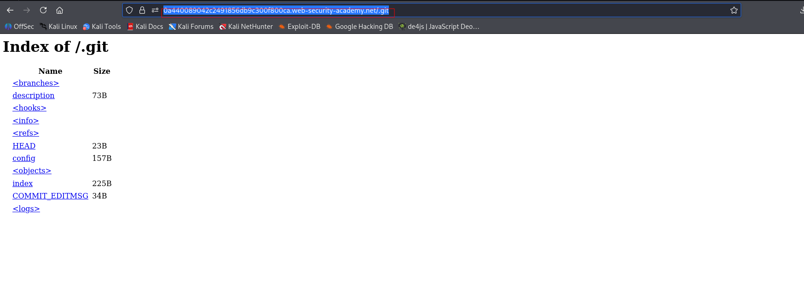
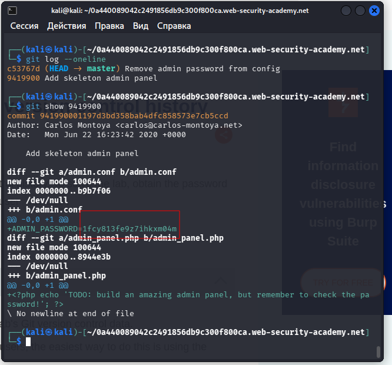

---

# Описание
Уязвимость раскрытия информации, при которой в web-доступной директории остаётся метаданные системы контроля версий (например, `.git`). Атакующий может восстановить исходный код приложения и изучить историю коммитов, включая удалённые файлы, hard-coded учётные данные, API-ключи и конфигурационные параметры. В учебном сценарии в истории коммитов обнаруживается пароль администратора.
## Обнаружение/Идентификация
Анализ файлов контроля версии позволил получить пароль администратора из сделанного коммита.

Рисунок 1 - Раскрытие информации о доступе
Скачиваем файл на компьютер

Рисунок 2 - Раскрытие пароля

## Риски

- **Раскрытие версий ПО**: атакующий подбирает эксплойты под конкретные версии фреймворков и библиотек.
- **Утечка внутренней структуры**: пути к файлам, имена классов, конфигурации.
- **Подготовка к дальнейшим атакам**: SQL-инъекции, RCE, path traversal, SSRF.
- **Нарушение compliance**: раскрытие технических деталей может нарушать требования по защите информации (GDPR, 152-ФЗ, PCI DSS).
- **Репутационные потери**: публичное раскрытие ошибок снижает доверие к приложению.
## Рекомендации

- **Отключить режим отладки** (debug) в production-окружении.
- **Использовать унифицированные сообщения об ошибках** без технических деталей (например, «Произошла ошибка. Попробуйте позже»).
- **Логировать подробности ошибок на сервере**, а клиенту возвращать только общий код ошибки.
- **Настроить обработчики исключений**, которые не раскрывают stack trace, версии и пути.
- **Обновлять фреймворки и библиотеки** до актуальных версий.
- **Включить WAF** для фильтрации ответов, содержащих технические детали.
- **Провести аудит** всех обработчиков ошибок и исключений на предмет утечки информации.
