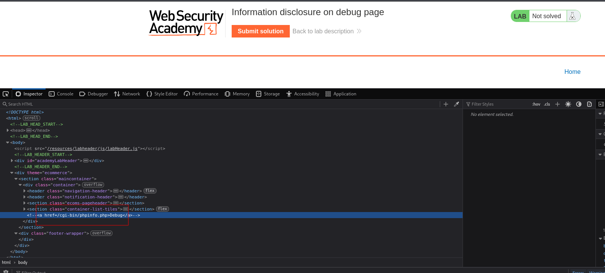
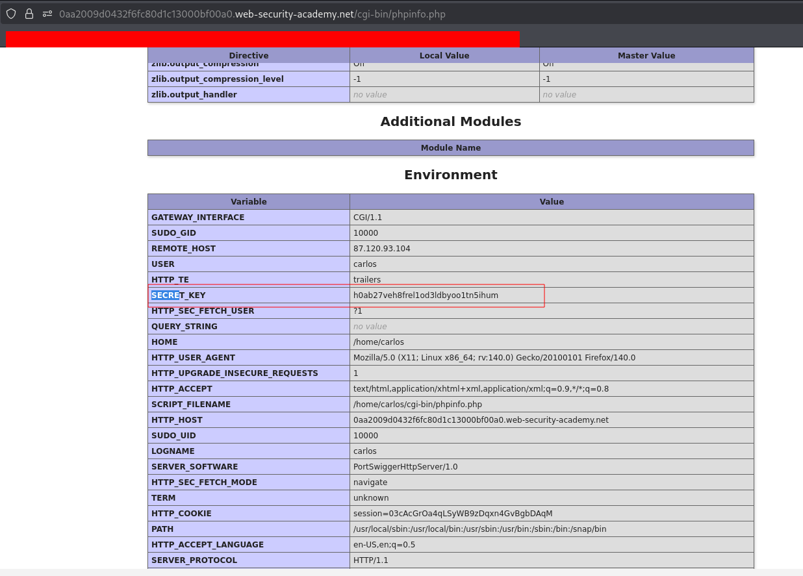

---

# Описание
Уязвимость раскрытия информации, при которой в production-окружении остаётся доступной отладочная страница (например, `phpinfo.php`, `/debug`, `/actuator/env`). Она отображает переменные окружения, включая `SECRET_KEY`, пути к файлам, версии ПО, конфигурационные параметры. Атакующий использует эти сведения для подделки сессий, токенов и дальнейших атак.
## Обнаружение/Идентификация
Исполнителем был обнаружен путь к отладочному файлу, содержащую техническую информацию.

Рисунок 1 - Раскрытие пути в комментарии

Рисунок 2 - Раскрытие технической информации
## Риски

- **Раскрытие версий ПО**: атакующий подбирает эксплойты под конкретные версии фреймворков и библиотек.
- **Утечка внутренней структуры**: пути к файлам, имена классов, конфигурации.
- **Подготовка к дальнейшим атакам**: SQL-инъекции, RCE, path traversal, SSRF.
- **Нарушение compliance**: раскрытие технических деталей может нарушать требования по защите информации (GDPR, 152-ФЗ, PCI DSS).
- **Репутационные потери**: публичное раскрытие ошибок снижает доверие к приложению.
## Рекомендации

- **Отключить режим отладки** (debug) в production-окружении.
- **Использовать унифицированные сообщения об ошибках** без технических деталей (например, «Произошла ошибка. Попробуйте позже»).
- **Логировать подробности ошибок на сервере**, а клиенту возвращать только общий код ошибки.
- **Настроить обработчики исключений**, которые не раскрывают stack trace, версии и пути.
- **Обновлять фреймворки и библиотеки** до актуальных версий.
- **Включить WAF** для фильтрации ответов, содержащих технические детали.
- **Провести аудит** всех обработчиков ошибок и исключений на предмет утечки информации.
