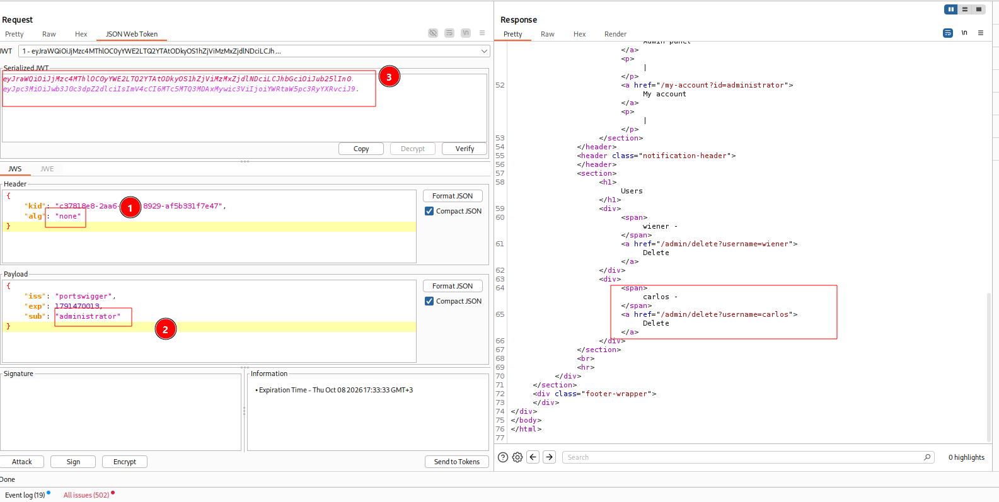

---

# Описание
Уязвимость обхода аутентификации, при которой серверная часть принимает JWT-токены с алгоритмом `alg: none`, что позволяет полностью пропустить проверку криптографической подписи. Атакующий изменяет заголовок токена на `{"alg":"none","typ":"JWT"}`, модифицирует полезную нагрузку (например, подменяет `sub` на `administrator`) и отправляет токен без подписи. Сервер доверяет данным из токена и предоставляет доступ к административной панели.
## Обнаружение/Идентификация
Для реализации уязвимости меняем sub на `administator`, alg на `none` и удаляем подпись jwt.

Рисунок 1 - Получение доступа к панели администратора

### Риски

- **Обход аутентификации**: подделка JWT с правами администратора.
- **Полный захват приложения**: управление пользователями, данными, настройками.
- **Утечка конфиденциальных данных**: доступ к персональной информации, финансовым данным.
- **Нарушение целостности**: удаление, модификация данных, внедрение бэкдоров.
- **Нарушение compliance**: утечка персональных данных (GDPR, 152-ФЗ).
### Рекомендации

- **Всегда проверять криптографическую подпись JWT** на сервере перед доверием данным.
- **Отклонять токены с `alg: none`** и неожиданными алгоритмами. Использовать белый список допустимых алгоритмов.
- **Проверять соответствие `alg` ожидаемому значению** — если приложение ожидает `RS256`, токен с `HS256` должен быть отклонён до проверки подписи.
- **Использовать проверенные библиотеки** (`jose`, `PyJWT`) с обязательным указанием допустимых алгоритмов.
- **Проверять claims** (`exp`, `nbf`, `iss`, `aud`) и сопоставлять `sub` с реальным пользователем в базе данных.
- **Не хранить секреты** в клиентском коде; использовать защищённое хранилище ключей (JWKS, KMS, vault).
- **Вести мониторинг** аномальных JWT-токенов и запросов к административным эндпоинтам.
- **Провести аудит** всего механизма валидации JWT на предмет обхода подписи.

