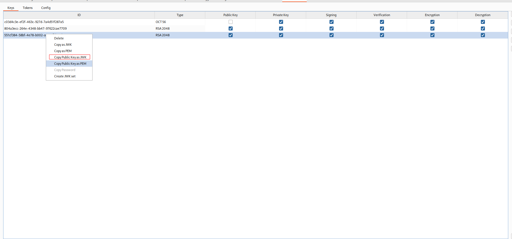
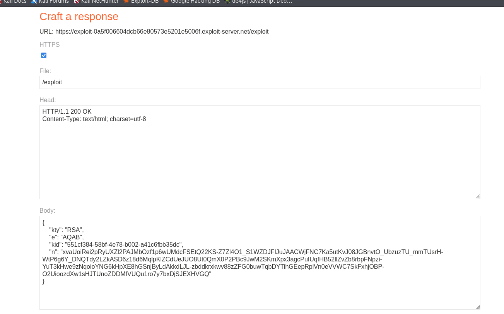
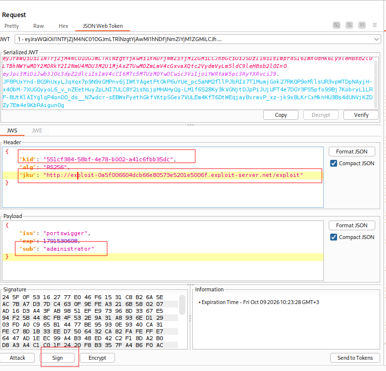

---

# Описание
Уязвимость обхода аутентификации, при которой серверная часть доверяет значению заголовка `jku` (JWK Set URL) в JWT-токене и загружает ключи для проверки подписи с произвольного URL, не сверяя его с белым списком доверенных доменов. Атакующий размещает собственный JWK Set на контролируемом сервере, указывает его URL в заголовке `jku`, подписывает поддельный токен своим приватным ключом и получает доступ к административной панели.
## Обнаружение/Идентификация
В ходе проведения работ был получен доступ к административной панели. Для эксплуатации необходимо создать RSA ключ, после чего скопировать его публичный ключ и вставить на сервер. Изменив данные JWT токена, подписываем ключом и получаем доступ к  панели. 

Рисунок 1 - Создание нового ключа

Рисунок 2 - Включение заголовков на сервер

Рисунок 3 -  Редактирование JWT
### Риски

- **Обход аутентификации**: подделка JWT с правами администратора.
- **Полный захват приложения**: управление пользователями, данными, настройками.
- **SSRF**: сервер выполняет запросы к произвольным URL, указанным в `jku`.
- **Утечка конфиденциальных данных**: доступ к персональной информации, финансовым данным.
- **Нарушение целостности**: удаление, модификация данных, внедрение бэкдоров.
- **Нарушение compliance**: утечка персональных данных (GDPR, 152-ФЗ).

### Рекомендации

- **Не доверять заголовку `jku`** — принимать URL JWK Set только из белого списка доверенных доменов.
- **Ограничить схемы URI** — разрешить только `https://` и отклонять `file://`, `ftp://`, `data://`
- **Проверять домен** — убедиться, что хост `jku` совпадает с ожидаемым (например, `your-domain.com`).
- **Использовать фиксированный ключ** из доверенного хранилища (JWKS, KMS, vault), а не извлекать его из токена.
- **Проверять алгоритм подписи** — отклонять токены с неожиданным `alg`.
- **Использовать проверенные библиотеки** (`jose`, `PyJWT` ≥ 2.13.0) с обязательным указанием допустимых алгоритмов и источников ключей.
- **Вести мониторинг** аномальных JWT-токенов и запросов к административным эндпоинтам.
- **Провести аудит** всего механизма валидации JWT на предмет обхода подписи.

