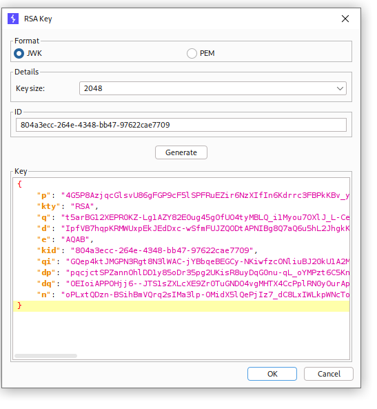
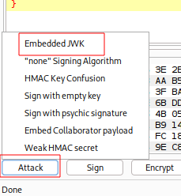
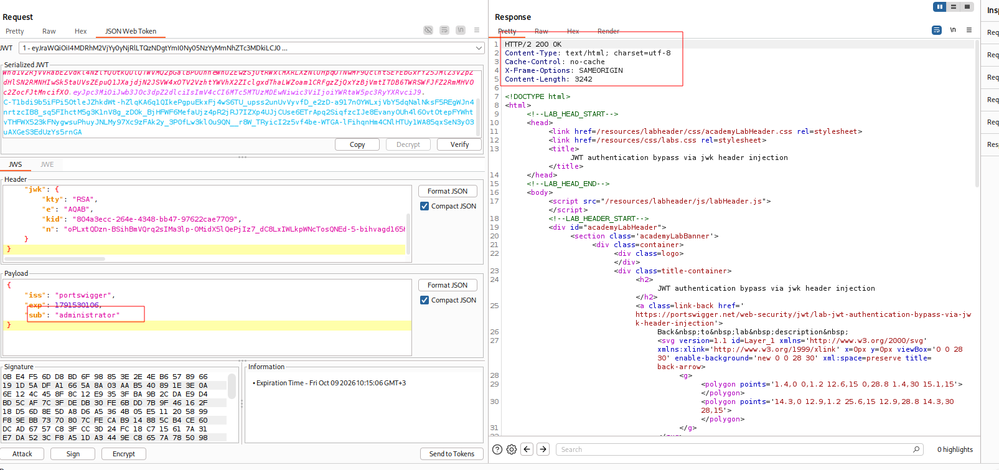

---

# Описание
Уязвимость обхода аутентификации, при которой серверная часть при проверке подписи JWT извлекает открытый ключ из заголовка `jwk` самого токена, не сверяя его с доверенным хранилищем ключей. Поскольку заголовок JWT полностью контролируется клиентом, атакующий может сгенерировать собственную пару ключей, подписать поддельный токен своим приватным ключом, встроить соответствующий публичный ключ в заголовок `jwk` и отправить его серверу. Сервер, доверяя встроенному ключу, принимает подпись как валидную и предоставляет доступ с произвольными правами, включая административные.
## Обнаружение/Идентификация

Рисунок 1 - Генерация нового ключа

Рисунок 2 - Атака

Рисунок 3 - Получение доступа к админ панели
### Риски

- **Обход аутентификации**: подделка JWT с правами администратора.
- **Полный захват приложения**: управление пользователями, данными, настройками.
- **Утечка конфиденциальных данных**: доступ к персональной информации, финансовым данным.
- **Нарушение целостности**: удаление, модификация данных, внедрение бэкдоров.
- **Нарушение compliance**: утечка персональных данных (GDPR, 152-ФЗ).

### Рекомендации

- **Не доверять заголовку `jwk`** — отклонять токены, содержащие `jwk` в заголовке, если только ключ не совпадает с ключом из доверенного хранилища.
- **Проверять `jku`** — принимать URL JWK Set только из белого списка доверенных доменов.
- **Использовать фиксированный ключ** из доверенного хранилища (JWKS, KMS, vault), а не извлекать его из токена.
- **Проверять алгоритм подписи** — отклонять токены с неожиданным `alg` (например, `HS256` при ожидаемом `RS256`).
- **Использовать проверенные библиотеки** (`jose`, `PyJWT`) с обязательным указанием допустимых алгоритмов и источников ключей.
- **Проверять claims** (`exp`, `nbf`, `iss`, `aud`) и сопоставлять `sub` с реальным пользователем в базе данных.
- **Ротировать ключи** и использовать уникальные ключи для разных типов токенов.
- **Вести мониторинг** аномальных JWT-токенов и запросов к административным эндпоинтам.
- **Провести аудит** всего механизма валидации JWT на предмет обхода подписи.

