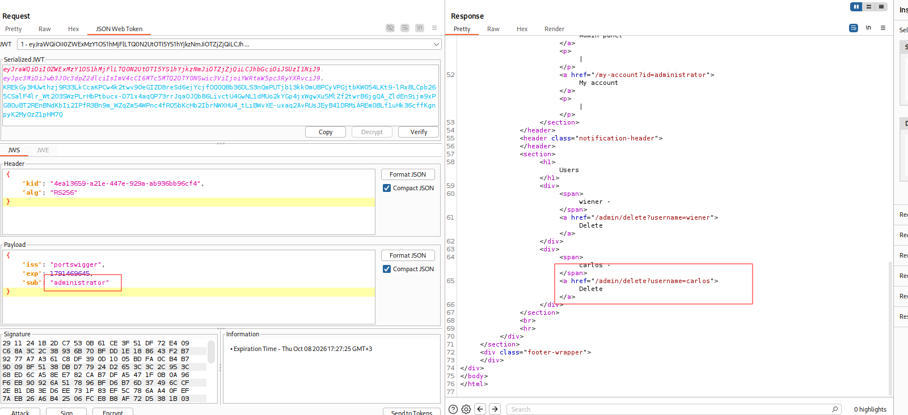

---

# Описание
Уязвимость обхода аутентификации, при которой серверная часть принимает JWT-токен, не выполняя проверку его криптографической подписи. Атакующий может изменить полезную нагрузку (payload) токена — например, подменить идентификатор пользователя на `administrator` или повысить роль — и отправить токен с исходной (или пустой) подписью. Сервер доверяет данным из токена и предоставляет доступ к административным функциям.
## Обнаружение/Идентификация
Изменяем в поле sub: `wiener` на `administrator`.

Рисунок 1 - Получение доступа к удалению пользователя
### Риски

- **Обход аутентификации**: подделка JWT с правами администратора.
- **Полный захват приложения**: управление пользователями, данными, настройками.
- **Утечка конфиденциальных данных**: доступ к персональной информации, финансовым данным.
- **Нарушение целостности**: удаление, модификация данных, внедрение бэкдоров.
- **Нарушение compliance**: утечка персональных данных (GDPR, 152-ФЗ).
### Рекомендации

- **Всегда проверять криптографическую подпись JWT** на сервере перед доверием данным.
- **Использовать проверенные библиотеки** (например, `jose`, `PyJWT`) с обязательным указанием допустимых алгоритмов.
- **Отклонять токены с `alg: none`** и неожиданными алгоритмами (например, `HS256` при ожидаемом `RS256`).
- **Проверять claims** (`exp`, `nbf`, `iss`, `aud`) и сопоставлять `sub` с реальным пользователем в базе данных.
- **Не хранить секреты** в клиентском коде; использовать защищённое хранилище ключей (JWKS, KMS, vault).
- **Ротировать ключи** и использовать уникальные ключи для разных типов токенов.
- **Вести мониторинг** аномальных JWT-токенов и запросов к административным эндпоинтам.
- **Провести аудит** всего механизма валидации JWT на предмет обхода подписи.

