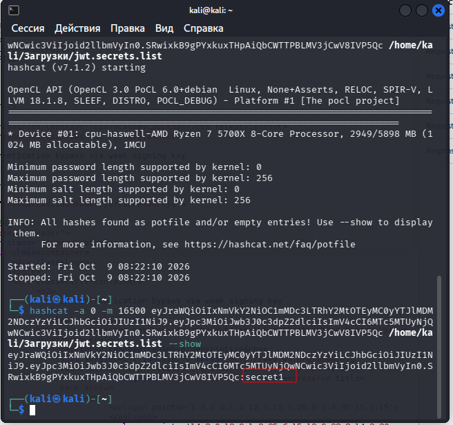
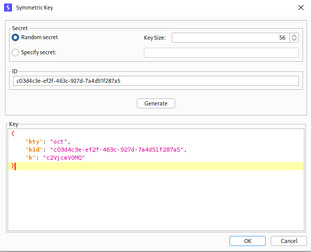

---

# Описание
Уязвимость обхода аутентификации, при которой приложение использует для подписи JWT симметричный ключ (HMAC, `HS256`) с недостаточной энтропией — короткий, предсказуемый или словарный секрет. Атакующий перехватывает валидный токен, подбирает секрет офлайн (brute-force / dictionary attack) и подделывает JWT с правами администратора, получая полный доступ к панели управления.
## Обнаружение/Идентификация
 В ходе выполнения работ был получен доступ к панели администратора. На рисунке 1 представлен перебор подписей JWT-токена.
 

Рисунок 1 - Брутфорс подписи
На рисунке 2 представлено создание новой подписи, с модификацией sub.

Рисунок 2 - Создание новой подписи

![]jwt_weak_key_admin.png)

Рисунок 3 - Получение доступа к панели администратора
### Риски

- **Обход аутентификации**: подделка JWT с правами администратора.
- **Полный захват приложения**: управление пользователями, данными, настройками.
- **Утечка конфиденциальных данных**: доступ к персональной информации, финансовым данным.
- **Нарушение целостности**: удаление, модификация данных, внедрение бэкдоров.
- **Нарушение compliance**: утечка персональных данных (GDPR, 152-ФЗ).

### Рекомендации

- **Использовать криптостойкие секреты** длиной не менее 256 бит (32 байта), сгенерированные CSPRNG.
- **Не хранить секреты в исходном коде** — использовать переменные окружения или секрет-менеджеры (Vault, KMS).
- **Перейти на асимметричные алгоритмы** (`RS256`, `ES256`) для критичных приложений.
- **Ограничить количество попыток** подбора и внедрить rate limiting на эндпоинтах аутентификации.
- **Вести мониторинг** аномальных JWT-токенов и запросов к административным эндпоинтам.
- **Ротировать ключи** и использовать уникальные ключи для разных типов токенов.
- **Провести аудит** конфигурации JWT на предмет использования слабых секретов.

