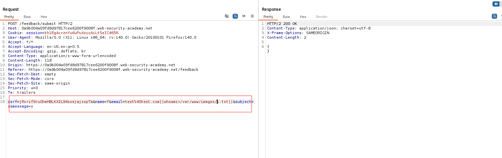
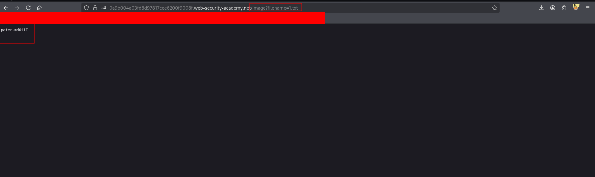

---

# Описание
Уязвимость внедрения команд ОС в функции обратной связи. Приложение выполняет системную команду, содержащую пользовательский ввод (параметр `email`), но не возвращает её вывод в HTTP-ответе. Атакующий использует разделители команд и перенаправление вывода (`>`) для записи результата выполнения команды в файл внутри web-доступной директории, после чего извлекает этот файл через HTTP.
## Обнаружение/Идентификация
В ходе эксплуатации уязвимости был получен доступ к инъекциям OS с последующей записью в каталог изображений. 

Рисунок 1 - Эксплуатация уязвимости
Обратимся к сохраненному файлу.

Рисунок 2 - Результат
## Риски

- **Полный захват сервера**: выполнение команд от имени веб-сервера.
- **Скрытая утечка данных**: нет вывода в ответе — WAF и мониторинг могут не обнаружить атаку.
- **Горизонтальное перемещение**: использование сервера как плацдарма для атак на внутреннюю сеть.
- **Установка постоянного бэкдора**: reverse shell, cron-задачи, вредоносные модули.
## Рекомендации

- **Избегать вызова системной оболочки**: использовать API ОС или встроенные функции языка.
- **Если shell неизбежен** — применять строгий белый список допустимых значений и экранирование.
- **Использовать параметризованные вызовы** (например, `execve` с массивом аргументов, без `shell=True`).
- **Ограничить права процесса**: запускать веб-сервер от непривилегированного пользователя.
- **Внедрить строгую валидацию** входных данных: белые списки для `email`, `subject`, `message`.
- **Отключить вывод ошибок** и деталей команд в production-окружении.
- **Включить WAF** с сигнатурами OS Command Injection (`|`, `;`, `&&`, `$(`).
- **Провести аудит** всех точек вызова системных команд.

