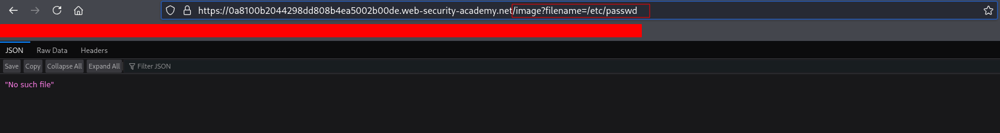
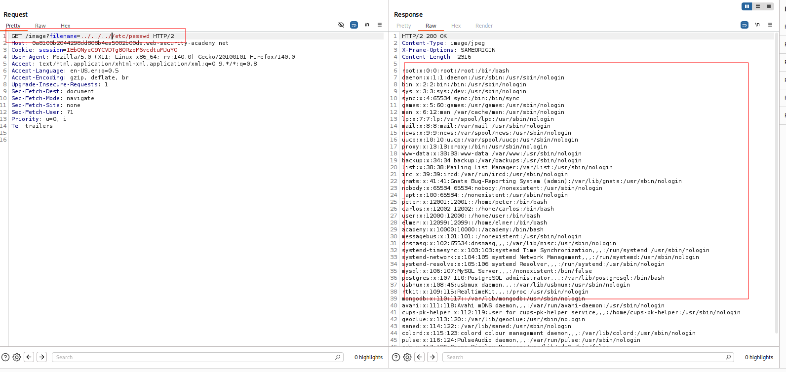

---

# Описание
Уязвимость обхода пути к файлу, при которой приложение использует пользовательский параметр (например, `filename`) для чтения файла из файловой системы без нормализации и проверки пути. Атакующий может использовать последовательности `../` для выхода за пределы разрешённой директории и чтения произвольных файлов, таких как `/etc/passwd`.
## Обнаружение/Идентификация

Рисунок 1 -  Путь к изображению

Рисунок 2 - Демонстрация вывода файла
## Риски
- **Утечка конфиденциальных данных**: чтение конфигураций, учётных данных, ключей, исходного кода.
- **Эскалация привилегий**: доступ к чувствительным файлам может привести к дальнейшей компрометации системы.
- **Нарушение compliance**: утечка персональных данных и коммерческой тайны (GDPR, 152-ФЗ).
- **Подготовка к дальнейшим атакам**: получение информации о структуре сервера и приложения.

## Рекомендации

- **Не использовать пользовательский ввод** для формирования путей к файлам.
- **Применять белый список** допустимых имён файлов.
- **Использовать `basename()`** или аналогичные функции для отсечения компонентов пути.
- **Нормализовать и проверять путь**: после канонизации убедиться, что он находится внутри разрешённой директории.
- **Хранить файлы вне webroot** и ограничить права процесса веб-сервера.
- **Включить WAF** с сигнатурами Path Traversal (`../`, `..%2f`, `%2e%2e`).
- **Провести аудит** всех точек работы с файловой системой.
