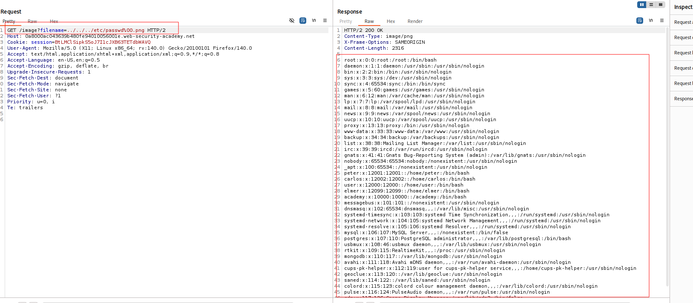

---

# Описание
Уязвимость обхода пути к файлу, при которой приложение проверяет, что пользовательский параметр `filename` заканчивается ожидаемым расширением (например, `.png`), но не нейтрализует NUL-символ (`%00`) во входных данных. Атакующий добавляет null-байт после последовательности обхода каталога, чтобы «обмануть» проверку расширения: на уровне валидации строка заканчивается на `.png`, но низкоуровневые функции файловой системы интерпретируют `%00` как терминатор строки, игнорируя всё, что следует за ним, и открывают произвольный файл (`/etc/passwd`).
## Обнаружение/Идентификация
Была изучена работа веб-приложения заказчика. Приложение отображает данные через конечную точку /image. Для обхода защитных мер был использован Nul-символ, позволяющий раскрыть содержимое файла /etc/passwd 

Рисунок 1 - Демонстрация раскрытия информации
## Риски
- **Утечка конфиденциальных данных**: чтение конфигураций, учётных данных, ключей, исходного кода.
- **Эскалация привилегий**: доступ к чувствительным файлам может привести к дальнейшей компрометации системы.
- **Нарушение compliance**: утечка персональных данных и коммерческой тайны (GDPR, 152-ФЗ).
- **Подготовка к дальнейшим атакам**: получение информации о структуре сервера и приложения.

## Рекомендации

- **Не использовать пользовательский ввод** для формирования путей к файлам.
- **Применять белый список** допустимых имён файлов.
- **Использовать `basename()`** или аналогичные функции для отсечения компонентов пути.
- **Нормализовать и проверять путь**: после канонизации убедиться, что он находится внутри разрешённой директории.
- **Хранить файлы вне webroot** и ограничить права процесса веб-сервера.
- **Включить WAF** с сигнатурами Path Traversal (`../`, `..%2f`, `%2e%2e`).
- **Провести аудит** всех точек работы с файловой системой.

