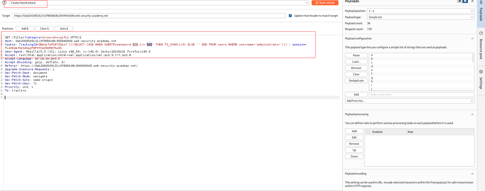
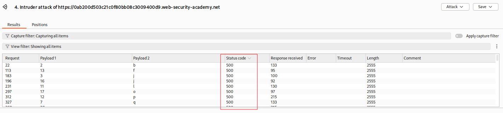

---

# Описание
Уязвимость «слепой» SQL-инъекции, при которой приложение не возвращает результаты запроса и не отражает ошибки СУБД. Запрос выполняется синхронно, поэтому можно инициировать условные временные задержки в ответе сервера, чтобы побайтово извлечь конфиденциальные данные (например, пароль администратора) из базы данных.
## Обнаружение/Идентификация
Опытным путем был получен пароль администратора на основе HTTP-ответов сервера. 

Рисунок 1 - Полезная нагрузка

Рисунок 2 - Результат выполнения
## Риски
- **Скрытая утечка данных**: нет прямого вывода — WAF и системы мониторинга могут не обнаружить атаку.
- **Компрометация учётных данных**: получение пароля администратора.
- **Полный захват приложения**: управление пользователями, данными, настройками.

## Рекомендации

- **Использовать параметризованные запросы** (prepared statements) для всех SQL-операций.
- **Применять ORM** с автоматическим экранированием.
- **Внедрить строгую валидацию** входных данных: белые списки для cookie и параметров.
- **Ограничить права учётной записи приложения**: запретить доступ к системным функциям и таблицам, не используемым в бизнес-логике.
- **Отключить вывод SQL-ошибок** в production-окружении (скрыть детали ошибок).
