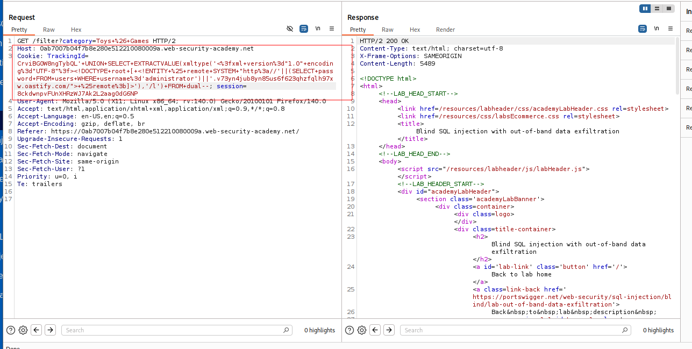
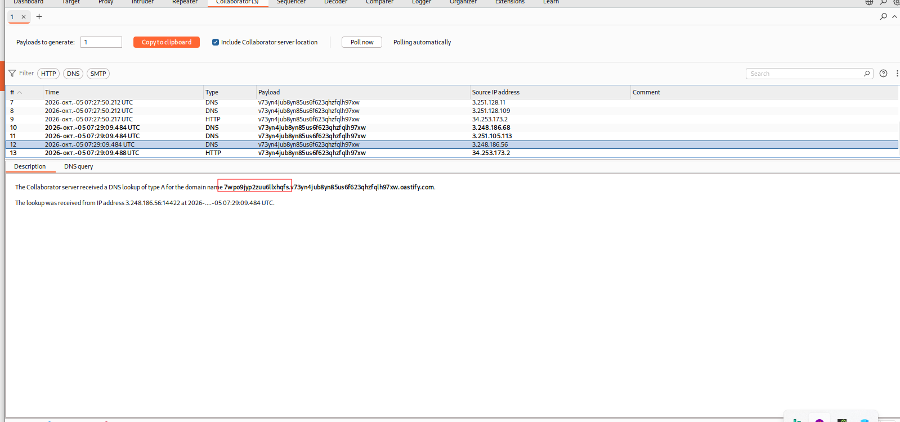

---

# Описание
Уязвимость «слепой» SQL-инъекции, при которой приложение не возвращает результаты запроса и не отражает ошибки СУБД, а сам запрос выполняется асинхронно. Исполнителем была внедрена полезная нагрузка, заставляющую СУБД выполнить разрешение DNS-имени, в поддомен которого подставляются извлечённые данные.
## Обнаружение/Идентификация
В результате перехвата запроса содержащие cookie-файлы, была выполнена полезная нагрузка для извлечения пароля администратора.

Рисунок 1 - HTTP-запрос с полезной нагрузкой

Рисунок 2 - Раскрытие пароля 
## Риски
- **Скрытая утечка данных**: нет прямого вывода в ответе — WAF и системы мониторинга не обнаруживают атаку.
- **Обход защитных механизмов**: асинхронное выполнение и внешний канал делают атаку невидимой
- **Компрометация учётных данных**: получение пароля администратора.

## Рекомендации

- **Использовать параметризованные запросы** (prepared statements) для всех SQL-операций.
- **Применять ORM** с автоматическим экранированием.
- **Ограничить исходящие соединения** СУБД: запретить DNS/HTTP-запросы к внешним доменам на уровне сетевого периметра.
- **Внедрить строгую валидацию** входных данных: белые списки для cookie и параметров.
