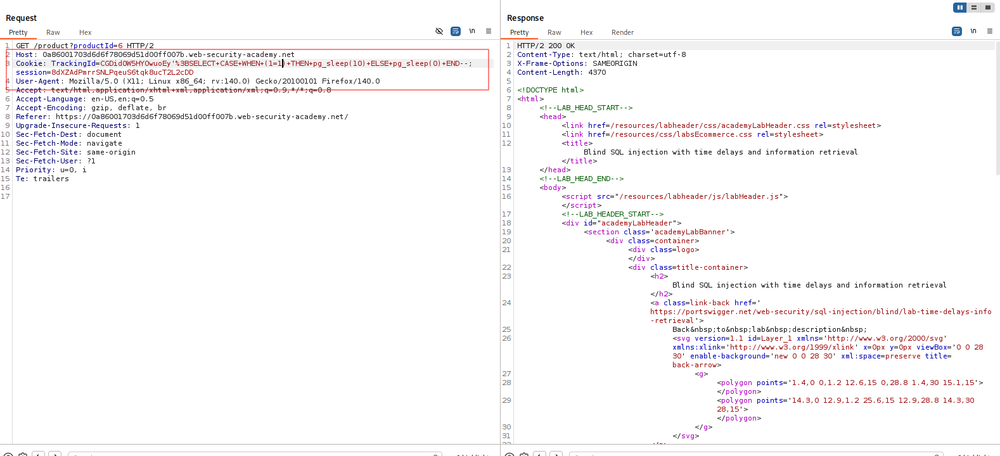
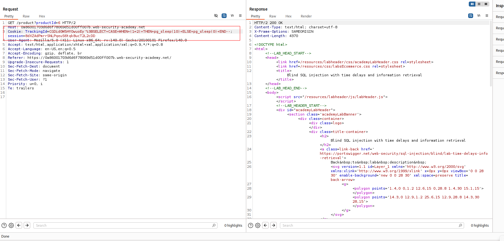
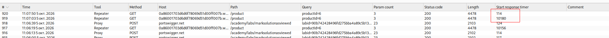
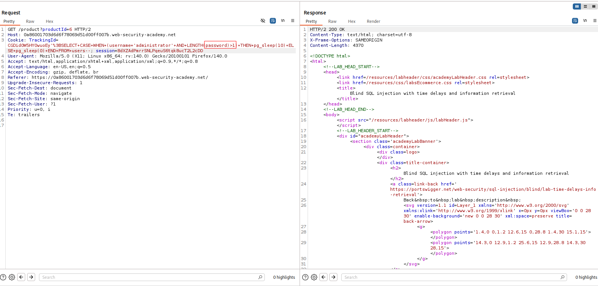
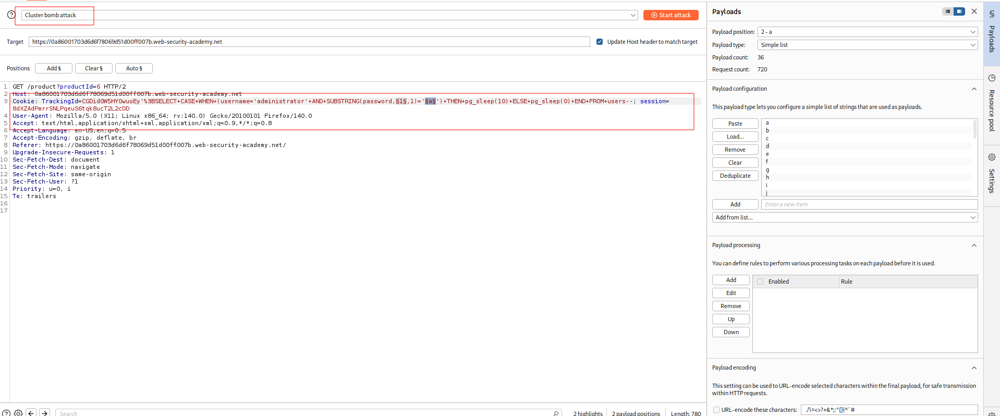
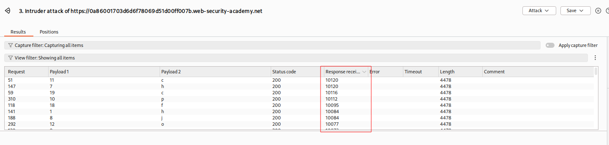

---

# Описание
Уязвимость «слепой» SQL-инъекции, при которой приложение не возвращает результаты запроса и не отражает ошибки СУБД. Запрос выполняется синхронно, поэтому можно инициировать условные временные задержки в ответе сервера, чтобы побайтово извлечь конфиденциальные данные (например, пароль администратора) из базы данных

## Обнаружение/Идентификация
Опытным путем был установлен пароль от пользователя администратор. Для идентификации уязвимости воспользуемся условиями TRUE и FALSE для идентификации разницы в HTTP-ответах.  

Рисунок 1 - True условие

Рисунок 2  - False условие
На рисунке 3 представлена разница во времени исполнения запросов.

Рисунок 3 - Разница в выполнении
## Эксплуатация/Реализация
Для определения длины пароля, используем полезную нагрузку с постепенным увеличением числа длины пароля, чтобы идентифицировать его длину.

Рисунок 4 - Определение длины пароля
После определения длины пароля, запускаем Intruder на перебор символов поэтапно. Идентификацию корректных символов пароля осуществляем по времени ответа.

Рисунок 5 - Перебор пароля

Рисунок 6 - Результаты
## Риски
- **Скрытая утечка данных**: нет прямого вывода  WAF и системы мониторинга не обнаруживают атаку.
- **Компрометация учётных данных**: получение пароля администратора.
- **Полный захват приложения**: управление пользователями, данными, настройками.

## Рекомендации

- **Использовать параметризованные запросы** (prepared statements) для всех SQL-операций.
- **Применять ORM** с автоматическим экранированием.
- **Внедрить строгую валидацию** входных данных: белые списки для cookie и параметров.
- **Ограничить права учётной записи приложения**: запретить доступ к системным функциям задержки.
