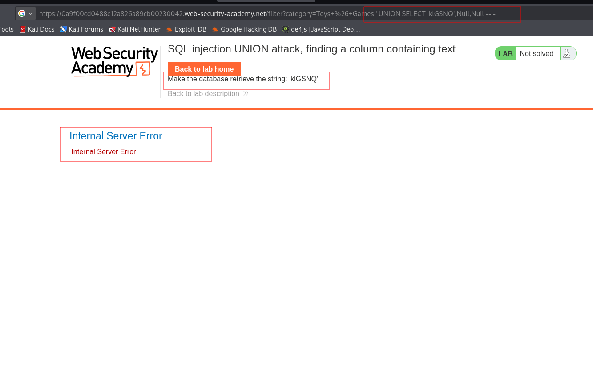
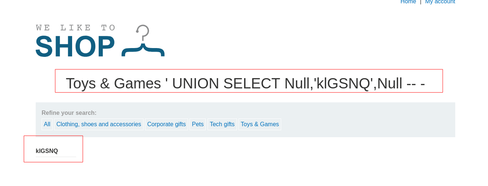

---

# Описание
После определения количества столбцов, проверяется совместимость со строковым типом. Для этого перебираем позиции подставляя строковый литерал. 
## Обнаружение/Идентификация
Была установлена позиция столбца со строковым типом.

Рисунок 1 - Поиск позиции по ошибке 

Рисунок 2 - Идентификация позиция

## Риски
- **Определение пригодного столбца** — ключевой шаг для успешного извлечения данных через `UNION SELECT`.
- **Утечка конфиденциальных данных** — логины, пароли, персональные данные, коммерческая тайна.
- **Полная компрометация базы данных** — при наличии прав на запись возможны модификация и удаление данных.

## Рекомендации

- **Использовать параметризованные запросы** (prepared statements) для всех SQL-операций.
- **Применять ORM** с автоматическим экранированием.
- **Внедрить строгую валидацию** входных данных: белые списки для полей фильтрации.
- **Ограничить права учётной записи приложения** — запретить доступ к системным представлениям и служебным таблицам.
- **Отключить вывод SQL-ошибок** в production-окружении.
- **Включить WAF** для блокировки сигнатур `UNION SELECT` и аномальных последовательностей `NULL`.
