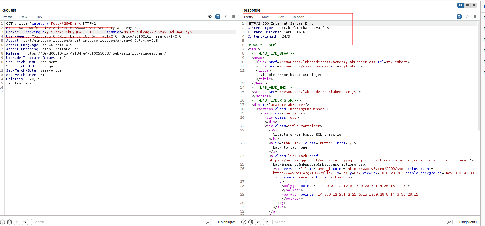
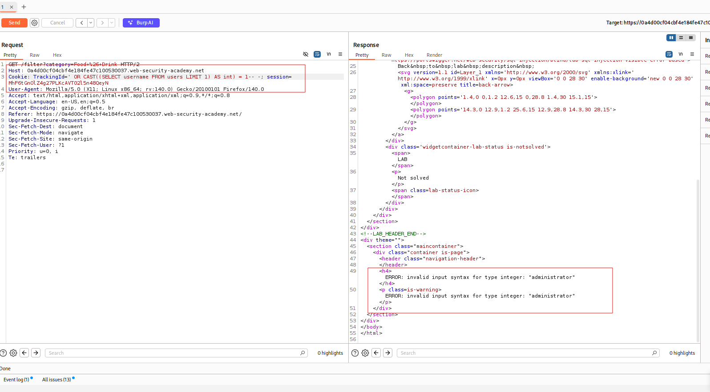
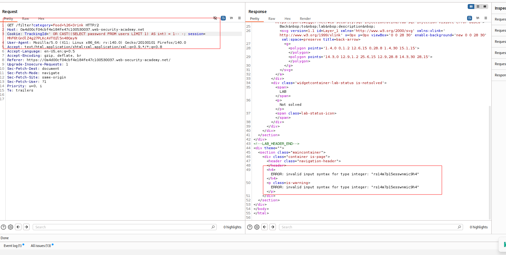

---

# Описание
Уязвимость SQL-инъекции, при которой приложение не возвращает результаты запроса напрямую, но отражает подробные сообщения об ошибках СУБД в HTTP-ответе. Пользователь получает возможность принудительно вызывает ошибку преобразования типа (через `CAST()`), чтобы извлечь данные (например, пароль администратора) непосредственно из текста ошибки.
## Обнаружение/Идентификация
Опытным путем в результате анализа HTTP-ответов приложения были получены учетные данные пользователя administartor

Рисунок 1 - Ошибка

Рисунок 2 - Вывод имени пользователя

Рисунок 3 - Вывод пароля пользователя

## Риски
- **Прямая утечка данных**: сообщения об ошибках содержат конфиденциальную информацию (имена пользователей, пароли, структура БД).
- **Компрометация учётных данных**: получение пароля администратора.
- **Полный захват приложения**: управление пользователями, данными, настройками.
## Рекомендации

- **Использовать параметризованные запросы** (prepared statements) для всех SQL-операций.
- **Применять ORM** с автоматическим экранированием.
- **Отключить вывод подробных SQL-ошибок** в production-окружении (использовать generic-сообщения).
- **Внедрить строгую валидацию** входных данных: белые списки для cookie и параметров.
- **Ограничить права учётной записи приложения**: запретить доступ к таблицам, не используемым в бизнес-логике.
