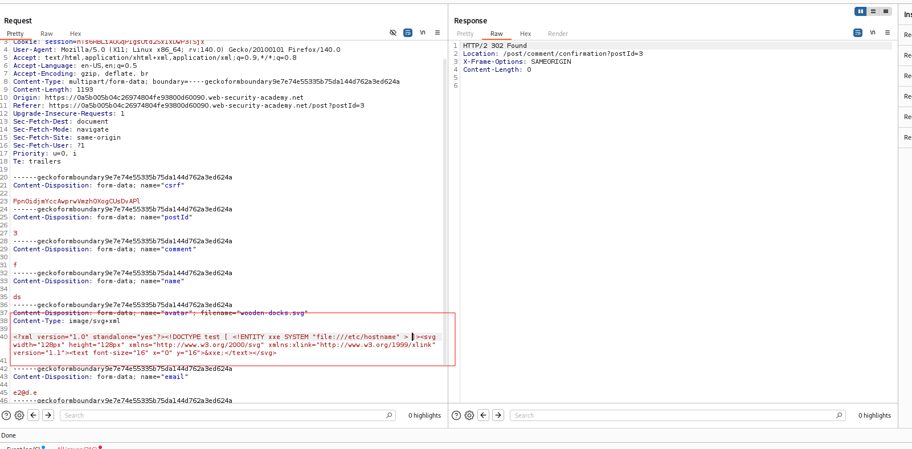
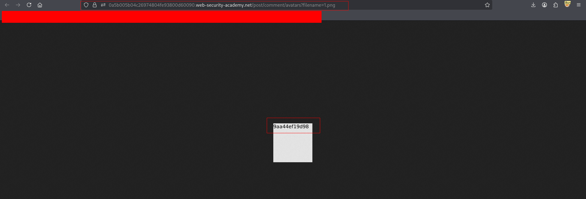

---

# Описание
Уязвимость XML External Entity (XXE) в функциональности загрузки аватаров, использующей библиотеку Apache Batik для обработки SVG-изображений. Поскольку формат SVG основан на XML, атакующий может внедрить внешнюю сущность, ссылающуюся на локальный файл (`file:///etc/hostname`), и прочитать его содержимое, которое отобразится в обработанном изображении.
## Обнаружение/Идентификация
В результате исполнения XXE-сущности Исполнителем было получено название хоста машины.

Рисунок 1 - Внедрение xxe

Рисунок 2 - Демонстрация результата
## Риски
- **Утечка конфиденциальных данных**: чтение конфигурационных файлов, учётных данных, ключей, `/etc/passwd`, `/etc/hostname`.
- **SSRF**: взаимодействие с внутренними сервисами через `http`-ссылки, доступ к метаданным облачных инстансов (IAM-ключи, токены).
- **DoS**: экспоненциальное расширение сущностей (Billion Laughs) для отказа в обслуживании.
- **Обход защитных механизмов**: SVG-файлы часто не проверяются антивирусами и WAF так же строго, как исполняемые файлы.

## Рекомендации

- **Отключить обработку внешних сущностей** и DTD в XML-парсере:
    - Java (Apache Batik): использовать `SAXParserFactory` с `setFeature("http://apache.org/xml/features/disallow-doctype-decl", true)`.
    - .NET: `XmlReaderSettings.DtdProcessing = DtdProcessing.Prohibit;`
    - Python: `defusedxml` блокирует внешние сущности по умолчанию.
- **Обновить Apache Batik** до версии 1.9 или выше, где устранены CVE-2017-5662 и CVE-2015-0250.
- **Внедрить строгую валидацию** загружаемых SVG: белые списки разрешённых тегов и атрибутов, отсечение `DOCTYPE` и `ENTITY`.
- **Ограничить права процесса** — запретить чтение системных файлов вне рабочей директории.
- **Включить WAF** с сигнатурами XXE (`<!ENTITY`, `SYSTEM`, `file://`) для загружаемых файлов.
- **Провести аудит** всех точек загрузки изображений на предмет обработки XML/SVG.
