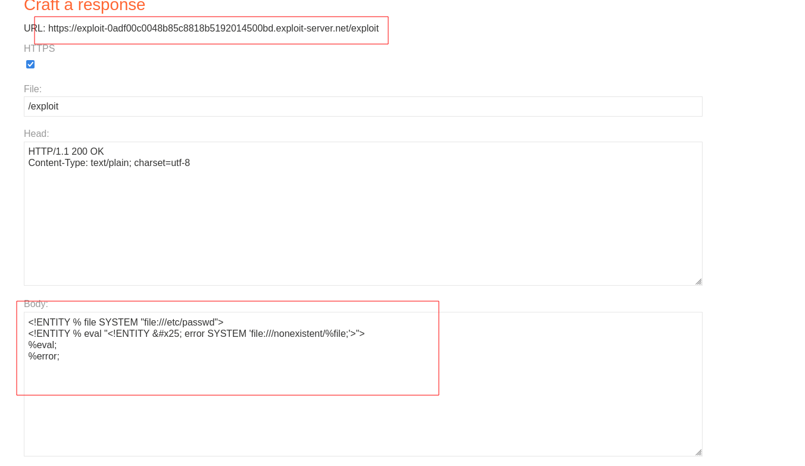
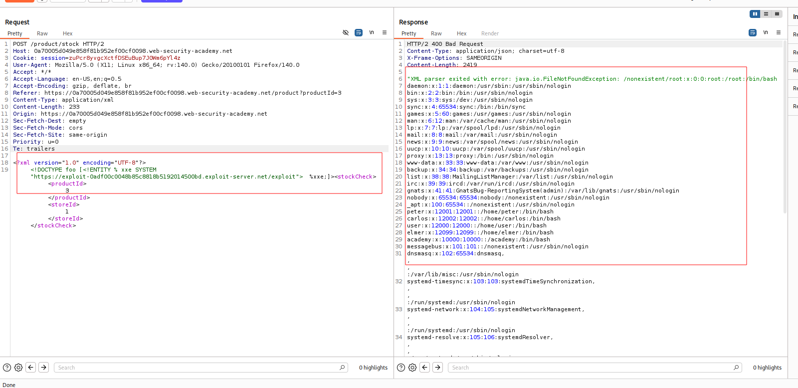

---

# Описание
Уязвимость «слепой» XML External Entity (XXE), при которой приложение парсит пользовательский XML с включённой обработкой внешних DTD и параметрических сущностей, но не отражает значения сущностей в HTTP-ответе. Атакующий размещает на контролируемом сервере вредоносный DTD-файл, который читает локальный файл и инициирует ошибку парсера, содержащую извлечённые данные в тексте сообщения об ошибке.
## Обнаружение/Идентификация
В ходе инициации ошибки парсера, исполнителем были извлечены данные в тексте сообщения об ошибке.

Рисунок 1 - Содержимое файла

Рисунок 2 - Раскрытие информации

## Риски
- **Утечка конфиденциальных данных**: чтение конфигурационных файлов, учётных данных, ключей, `/etc/passwd`, `Web.config` с database credentials.
- **SSRF**: взаимодействие с внутренними сервисами через внешние сущности.
- **DoS**: экспоненциальное расширение сущностей (Billion Laughs) для отказа в обслуживании.
- **Обход защитных механизмов**: error-based техника не требует исходящего сетевого взаимодействия (в отличие от out-of-band), что позволяет обойти сетевые фильтры.
## Рекомендации

- **Отключить обработку внешних DTD и параметрических сущностей** в XML-парсере:
    - Java: `factory.setFeature("http://apache.org/xml/features/disallow-doctype-decl", true);`
    - .NET: `XmlReaderSettings.DtdProcessing = DtdProcessing.Prohibit;`
    - Python: `defusedxml` блокирует внешние сущности по умолчанию.
- **Отключить вывод подробных сообщений об ошибках** парсера в production-окружении (использовать generic-сообщения).
- **Использовать безопасные парсеры** с настройками по умолчанию.
- **Ограничить исходящие соединения** сервера: запретить DNS/HTTP-запросы к внешним доменам на уровне сетевого периметра.
- **Внедрить строгую валидацию** XML-ввода: белые списки схем, отсечение `DOCTYPE` и `ENTITY`.
- **Включить WAF** с сигнатурами XXE (`<!ENTITY`, `SYSTEM`, `%xxe;`).
- **Провести аудит** всех XML-эндпоинтов на предмет обработки внешних DTD.
